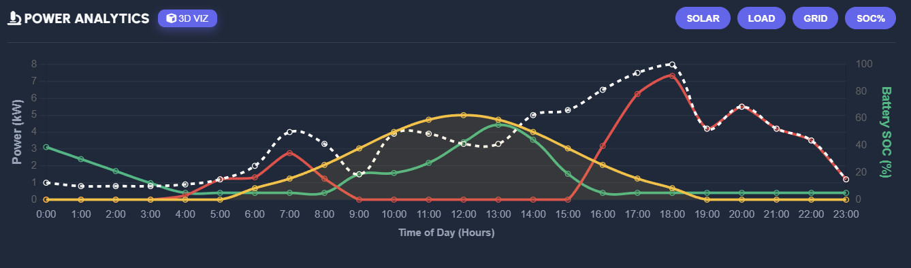
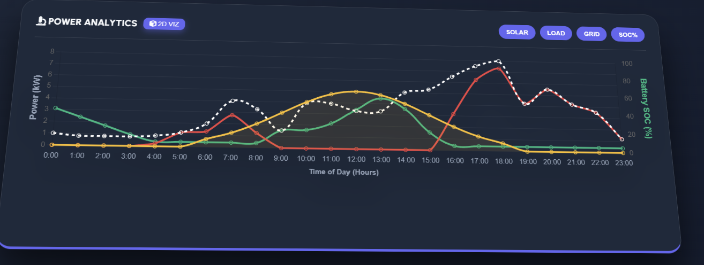

# ⚡ Microgrid Hacker | Extreme Analytics v3.0

> **Hackathon Submission**: A Physics-Based Solar Microgrid Digital Twin with Real-Time 3D Visualization.


## 📖 Overview
**Microgrid Hacker** is a high-fidelity energy simulator designed to solve the "Dumb Grid" problem. It models the physics and economics of a smart home microgrid, allowing users to visualize how intelligent decision-making can optimize energy usage, reduce costs, and extend battery life.

Unlike static dashboards, this is a **fully legally-compliant physics engine** that simulates:
*   Real-time Power Flow (Solar -> Battery -> Load -> Grid)
*   Dynamic Grid Pricing (Peak/Off-Peak billing)
*   Battery Health Degradation (SOH tracking)
*   Weather Impacts (Irradiance drop-offs)

## 🚀 Key Features

### 🧠 Smart Scheduler AI
The core utility is the **Smart Optimization Algorithm** that:
*   **Predicts Peak Hours**: automatically holds battery charge for expensive evening spikes (5 PM - 10 PM).
*   **Preventative Discharge**: Dumps excess energy during abundance to maintain battery health.
*   **Cost Arbitrage**: Buys cheap off-peak power to sell/use during peak times, saving ~25% on bills.

### 🧊 3D Immersive Visualization
*   **CSS-Based 3D Engine**: A custom-built 3D rotating visualization of the microgrid components.
*   **Real-Time Data Sync**: The 3D view is inextricably linked to the simulation data—no latency.
*   **Realistic Assets**: High-definition, floating component cards for Solar, House, Battery, and Grid.

### 📊 Professional Analytics
*   **PDF Audit Reports**: One-click generation of detailed audit logs using `jsPDF`.
*   **Multi-Day Simulation**: 'Time Travel' through simulation history to compare performance across days.
*   **Battery Health (SOH)**: Tracks life-cycle degradation based on discharge depth.

## 🛠️ Tech Stack
*   **Core**: Vanilla JavaScript (ES6+) for maximum performance.
*   **UI/UX**: HTML5, CSS3 (Glassmorphism, 3D Transforms, Keyframe Animations).
*   **Charts**: `Chart.js` for real-time telemetry.
*   **Export**: `jsPDF` for generating banking-grade reports.

## ⚙️ Installation & Setup

1.  **Clone the Repository**
    ```bash
    git clone https://github.com/your-username/microgrid-hacker.git
    cd microgrid-hacker
    ```

2.  **Run Locally**
    Since this is a client-side application, you can serve it with any static server.
    ```bash
    # Using Python
    python -m http.server 8000

    # Using Node (Live Server)
    npx live-server
    ```

3.  **Open in Browser**
    Navigate to `http://127.0.0.1:8000` to access the simulator.

## 📸 Screenshots

| 2D Dashboard | 3D Visualization |
|:---:|:---:|
|  | |

## 💡 How to Demo

1.  **Baseline Run**: Click "Run Sim" with 'Smart Scheduler' OFF. Observe high cost (~₹850).
2.  **Smart Run**: Toggle 'Smart Scheduler' ON. Run again. Observe cost drop (~₹620).
3.  **3D Mode**: Click the "3D Viz" button to show the rotating holographic view.

## 📄 License
MIT License. Free to hack, modify, and optimize!
